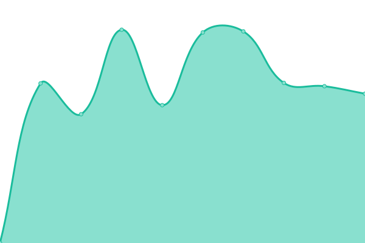

# [📈 Live Status](https://UQ-RCC.github.io/portals): <!--live status--> **🟧 Partial outage**

This repository contains the open-source uptime monitor and status page for [Research Computing Centre](https://rcc.uq.edu.au/), powered by [Upptime](https://github.com/upptime/upptime).

With [Upptime](https://upptime.js.org), you can get your own unlimited and free uptime monitor and status page, powered entirely by a GitHub repository. We use [Issues](https://github.com/UQ-RCC/portals/issues) as incident reports, [Actions](https://github.com/UQ-RCC/portals/actions) as uptime monitors, and [Pages](https://UQ-RCC.github.io/portals) for the status page.

<!--start: status pages-->
<!-- This summary is generated by Upptime (https://github.com/upptime/upptime) -->
<!-- Do not edit this manually, your changes will be overwritten -->
<!-- prettier-ignore -->
| URL | Status | History | Response Time | Uptime |
| --- | ------ | ------- | ------------- | ------ |
|  RCC auth | 🟩 Up | [rcc-auth.yml](https://github.com/UQ-RCC/portals/commits/HEAD/history/rcc-auth.yml) | 

 949ms
     
 | 

<a href="https://UQ-RCC.github.io/portals/history/rcc-auth">100.00%</a>
    

|  IPP | 🟩 Up | [ipp.yml](https://github.com/UQ-RCC/portals/commits/HEAD/history/ipp.yml) | 

 916ms
     
 | 

<a href="https://UQ-RCC.github.io/portals/history/ipp">100.00%</a>
    

|  IPP pref version | 🟩 Up | [ipp-pref-version.yml](https://github.com/UQ-RCC/portals/commits/HEAD/history/ipp-pref-version.yml) | 

 212ms
     
 | 

<a href="https://UQ-RCC.github.io/portals/history/ipp-pref-version">100.00%</a>
    

|  Pitchi | 🟥 Down | [pitchi.yml](https://github.com/UQ-RCC/portals/commits/HEAD/history/pitchi.yml) | 

 1389ms
     
 | 

<a href="https://UQ-RCC.github.io/portals/history/pitchi">99.88%</a>
    

|  Pitschi XAPI user | 🟥 Down | [pitschi-xapi-user.yml](https://github.com/UQ-RCC/portals/commits/HEAD/history/pitschi-xapi-user.yml) | 

 229ms
     
 | 

<a href="https://UQ-RCC.github.io/portals/history/pitschi-xapi-user">99.88%</a>
    

|  Pitschi XAPI1 user | 🟩 Up | [pitschi-xapi-1-user.yml](https://github.com/UQ-RCC/portals/commits/HEAD/history/pitschi-xapi-1-user.yml) | 

 917ms
     
 | 

<a href="https://UQ-RCC.github.io/portals/history/pitschi-xapi-1-user">100.00%</a>
    

|  Pitschi XAPI2 user | 🟩 Up | [pitschi-xapi-2-user.yml](https://github.com/UQ-RCC/portals/commits/HEAD/history/pitschi-xapi-2-user.yml) | 

 889ms
     
 | 

<a href="https://UQ-RCC.github.io/portals/history/pitschi-xapi-2-user">100.00%</a>
    

<!--end: status pages-->

[**Visit our status website →**](https://UQ-RCC.github.io/portals)

## 📄 License

- Powered by: [Upptime](https://github.com/upptime/upptime)
- Code: [MIT](./LICENSE) © [Research Computing Centre](https://rcc.uq.edu.au/)
- Data in the `./history` directory: [Open Database License](https://opendatacommons.org/licenses/odbl/1-0/)
